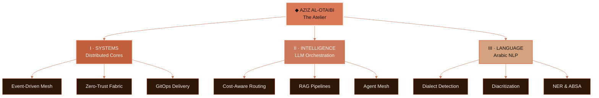
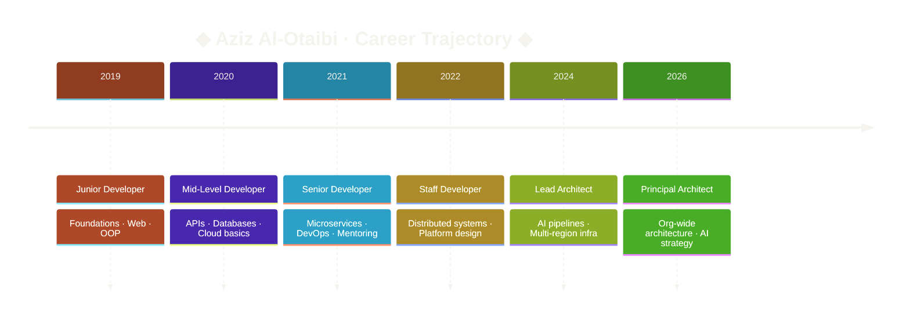

<!-- ════════════════════════════════════════════════════════════════════════════
     AZIZ AL-OTAIBI · README · ANTHROPIC EMBER EDITION · v9.0
     ────────────────────────────────────────────────────────────────────────
     SETUP CHECKLIST:
       1. Replace YOUR_LINKEDIN  → your LinkedIn handle
       2. Replace YOUR_TWITTER   → your X / Twitter handle
       3. Replace YOUR_PORTFOLIO → your portfolio domain
       4. Replace YOUR_MEDIUM    → your Medium handle
       5. Verify GitHub username → AZIIZALOYIBI (used by all stat images)
       6. Snake animation needs a Platane/snk GitHub Action → "output" branch.
          Otherwise remove the snake .
     ────────────────────────────────────────────────────────────────────────
     ANTHROPIC PALETTE
       Ember / Clay   #D97757   ·  primary
       Crail          #C15F3C   ·  deep burnt orange
       Book Cloth     #CC785C   ·  warm clay
       Kraft          #D4A27F   ·  sand
       Manilla        #F4F3EE   ·  cream (text on dark)
       Anthropic Ink  #141413   ·  background
     ════════════════════════════════════════════════════════════════════════════ -->


<!-- ─────────────────────────────  HERO  ───────────────────────────── -->


<p align="center">
  
</p>

<p align="center">
  
</p>

<p align="center">
  
</p>

<p align="center">
  <sub><i>◆ Anthropic Ember ◆ Ink Black → Ember Glow → Kraft Sand ◆</i></sub>
</p>

<br/>

<!-- ─────────────────────────────  STATUS  ───────────────────────────── -->

<p align="center">
  
  
  
  
</p>

<p align="center">
  
  
  
</p>

<p align="center">
  <a href="https://linkedin.com/in/YOUR_LINKEDIN"></a>
  <a href="https://x.com/YOUR_TWITTER"></a>
  <a href="https://github.com/AZIIZALOYIBI"></a>
  <a href="mailto:alotaibiaziz322@gmail.com"></a>
  <a href="https://YOUR_PORTFOLIO.com"></a>
  <a href="https://medium.com/@YOUR_MEDIUM"></a>
</p>

<p align="center">
  
  
  
</p>

<br/>

<p align="center">
  
</p>

<br/>

<!-- ═════════════════════  § I · PROLOGUE  ═════════════════════ -->

<p align="center">
  
</p>

<p align="center">
  
</p>

<br/>

```typescript
// aziz.identity.ts  ·  v9.0
interface Innovator {
  readonly soul:      "Builder";
  readonly compass:   "Truth × Craft × Impact";
  readonly horizon:   "Infinite";
}

const AZIZ: Innovator & Profile = {
  name:         "Aziz Al-Otaibi  ·  عزيز العتيبي",
  title:        "Principal Innovator & Developer",
  subtitle:     "Systems Architect · AI Builder · Arabic NLP",

  location:     "Riyadh, Saudi Arabia 🇸🇦",
  timezone:     "UTC+3",
  contact:      "alotaibiaziz322@gmail.com",

  focus: [
    "◆ Distributed Systems        // multi-region · event-sourced",
    "◇ AI / ML Engineering        // orchestration · RAG · agents",
    "◈ Cloud-Native Infra         // GitOps · zero-trust · SRE",
    "✦ Arabic NLP Research        // dialect-aware · culturally rooted"
  ],

  philosophy: [
    "Simplicity at scale",
    "Fail fast · Recover faster",
    "Observability first",
    "Data-driven decisions",
    "Security by default",
    "API-first contracts",
    "Immutable infrastructure",
    "Progressive delivery"
  ],

  soul:    "Builder",
  compass: "Truth × Craft × Impact",
  horizon: "Infinite",

  status:  "◆ Open to elite opportunities ◆"
} as const;
```

<br/>

<!-- ═════════════════════  § II · THE ATELIER  ═════════════════════ -->

<p align="center">
  
</p>

<p align="center">
  
</p>

<p align="center">
  <i>Three rooms · One craft · A lifetime of refinement</i>
</p>

<br/>



<br/>

<div align="center">

| <br/>**SYSTEMS** | <br/>**INTELLIGENCE** | <br/>**LANGUAGE** |
|:---:|:---:|:---:|
| Distributed Cores | LLM Orchestration | Dialect Detection |
| Event-Driven Mesh | RAG Pipelines | Diacritization |
| Zero-Trust Fabric | Cost-Aware Routing | NER & ABSA |
| GitOps Delivery | Agent Mesh | Topic Evolution |
| 4-Region Active-Active | Semantic Caching | Gulf · Levantine · Maghrebi |
| `99.99 % uptime` | `94.7 % accuracy` | `96.2 % dialect ID` |

</div>

<br/>

<!-- ═════════════════════  § III · ARSENAL  ═════════════════════ -->

<p align="center">
  
</p>

<p align="center">
  
</p>

<details open>
<summary align="center"><b>◆ LANGUAGES · لغات البرمجة ◆</b></summary>
<br/>
<p align="center">
  
  
  
  
  
  
  
</p>
</details>

<details open>
<summary align="center"><b>◇ FRONTEND · واجهات المستخدم ◇</b></summary>
<br/>
<p align="center">
  
  
  
  
  
  
</p>
</details>

<details open>
<summary align="center"><b>◈ BACKEND & APIs · الخوادم والواجهات ◈</b></summary>
<br/>
<p align="center">
  
  
  
  
  
  
</p>
</details>

<details open>
<summary align="center"><b>✦ DATA & STREAMING · البيانات والتدفّق ✦</b></summary>
<br/>
<p align="center">
  
  
  
  
  
  
  
</p>
</details>

<details open>
<summary align="center"><b>✧ CLOUD & SRE · السحابة والموثوقيّة ✧</b></summary>
<br/>
<p align="center">
  
  
  
  
  
  
  
</p>
</details>

<details open>
<summary align="center"><b>✶ AI / ML · الذكاء الاصطناعي ✶</b></summary>
<br/>
<p align="center">
  
  
  
  
  
  
  
</p>
</details>

<br/>

<!-- ═════════════════════  § IV · CATALOGUE  ═════════════════════ -->

<p align="center">
  
</p>

<p align="center">
  
</p>

<p align="center">
  <i>Four flagships · Each a study in craft</i>
</p>

<br/>

<table align="center" width="100%">
<tr>
<td width="50%" valign="top">

<p align="center">
  
</p>

### Quantum SuperSystem · v3.0

<p align="center">
  
  
  
</p>

A 4-region active-active platform combining CQRS, Event Sourcing, and an Istio zero-trust mesh, delivered via ArgoCD GitOps. Engineered for graceful degradation, never heroics.

<p align="center">
  
  
  
</p>

</td>
<td width="50%" valign="top">

```go
// quantum/v3/core/supersystem.go
package quantum

type SuperSystem struct {
    Regions  []string  // 4 active-active
    Mesh     Service   // Istio · mTLS
    EventBus Stream    // Kafka + Flink
    Storage  Polyglot  // PG · Redis · CH
    Delivery GitOps    // ArgoCD + Helm
    Observ   Telemetry // OTel → Grafana
}

// Posture: graceful degrade
//          never heroics
```

</td>
</tr>
</table>

<br/>

<table align="center" width="100%">
<tr>
<td width="50%" valign="top">

```python
# neural/router/orchestrator.py
class NeuralRouter:
    models = [
        "gpt-4o",
        "claude-3.7-sonnet",
        "gemini-2.0-pro",
        "llama-3.3-70b"
    ]
    cache  = SemanticRedis(τ=0.92)
    rag    = [Pinecone, Weaviate, Qdrant]
    agents = LangGraph | CrewAI | AutoGen

    # Cost ↓ 73 %  ·  Accuracy 94.7 %
```

</td>
<td width="50%" valign="top">

<p align="center">
  
</p>

### Neural LLM Orchestrator

<p align="center">
  
  
  
</p>

Cost-aware multi-model orchestration with semantic caching across Redis, parallel RAG retrieval over Pinecone, Weaviate, and Qdrant, and agent meshes built with LangGraph, CrewAI, and AutoGen.

<p align="center">
  
  
  
</p>

</td>
</tr>
</table>

<br/>

<table align="center" width="100%">
<tr>
<td width="50%" valign="top">

<p align="center">
  
</p>

### Cars Square

<p align="center">
  
  
  
</p>

A real-time automotive SaaS engineered for GCC and MENA markets — Next.js 14 RSC, partitioned PostgreSQL, semantic Elasticsearch, and AWS ECS with multi-AZ resilience. RTL-native from the first pixel.

<p align="center">
  
  
  
</p>

</td>
<td width="50%" valign="top">

```typescript
// cars-square/platform.config.ts
export const Platform = {
  region:    "GCC + MENA",
  frontend:  "Next.js 14 · RSC · RTL",
  database:  "PostgreSQL partitioned",
  search:    "Elasticsearch semantic",
  cloud:     "AWS ECS · RDS Multi-AZ",
  edge:      "CloudFront",
  auth:      "OAuth2 + MFA",
  realtime:  "WebSocket PWA",
  scale:     "1M+ daily transactions"
} as const;
```

</td>
</tr>
</table>

<br/>

<table align="center" width="100%">
<tr>
<td width="50%" valign="top">

```python
# arabicmind/core/engine.py
class ArabicMind:
    base = "AraBERT-v2 (fine-tuned)"

    dialects = [
        "Gulf",       # خليجي
        "Levantine",  # شامي
        "Maghrebi",   # مغاربي
        "Egyptian"    # مصري
    ]

    capabilities = {
        "dialect_detection":  "96.2%",
        "diacritization":     "94.1%",
        "named_entity":       "92.8%",
        "sentiment_aspect":   "91.5%",
        "topic_evolution":    "real-time"
    }
```

</td>
<td width="50%" valign="top">

<p align="center">
  
</p>

### ArabicMind NLP Engine

<p align="center">
  
  
  
</p>

A dialect-aware Arabic NLP engine built on a fine-tuned AraBERT-v2. Detects Gulf, Levantine, Maghrebi, and Egyptian dialects, restores diacritics, extracts named entities, and tracks topic evolution in real-time streams.

<p align="center">
  
  
  
</p>

</td>
</tr>
</table>

<br/>

<!-- ═════════════════════  § V · PHILOSOPHY  ═════════════════════ -->

<p align="center">
  
</p>

<p align="center">
  
</p>

<div align="center">

|  |  |  |
|:---|:---|:---|
| ◇ Simplicity at scale | ◇ Domain-Driven Design | ◇ SLO-driven engineering |
| ◇ Fail fast · Recover faster | ◇ CQRS + Event Sourcing | ◇ MTTR < 5 minutes |
| ◇ Observability first | ◇ Saga orchestration | ◇ Zero-downtime deploys |
| ◇ Data-driven decisions | ◇ Circuit Breaker | ◇ Blue-green + Canary |
| ◇ Security by default | ◇ Strangler Fig | ◇ Chaos drills monthly |
| ◇ API-first contracts | ◇ BFF + Sidecar | ◇ Latency budgets |
| ◇ Immutable infrastructure | ◇ Outbox pattern | ◇ Continuous verification |

</div>

<br/>

<!-- ═════════════════════  § VI · TRAJECTORY  ═════════════════════ -->

<p align="center">
  
</p>

<p align="center">
  
</p>



<br/>

<div align="center">

| Year | Stage | Focus |
|:---:|:---|:---|
| **2019** |  | Foundations · Web · OOP |
| **2020** |  | APIs · Databases · Cloud basics |
| **2021** |  | Microservices · DevOps · Mentoring |
| **2022** |  | Distributed systems · Platform design |
| **2024** |  | AI pipelines · Multi-region infra |
| **2026** |  | Org-wide architecture · AI strategy |

</div>

<br/>

<!-- ═════════════════════  § VII · IMPACT METRICS  ═════════════════════ -->

<p align="center">
  
</p>

<p align="center">
  
</p>

<div align="center">

|  |  |  |  |
|:---:|:---:|:---:|:---:|
| **Years Experience** | **Projects Shipped** | **Contributions** | **Client Success** |

|  |  |  |  |
|:---:|:---:|:---:|:---:|
| **Daily Transactions** | **AI Models Integrated** | **RPS Capacity** | **Uptime SLO** |

|  |  |  |  |
|:---:|:---:|:---:|:---:|
| **P99 Latency** | **Cache Hit Rate** | **Routing Accuracy** | **Dialect Precision** |

</div>

<br/>

<!-- ═════════════════════  § VIII · ANALYTICS  ═════════════════════ -->

<p align="center">
  
</p>

<p align="center">
  
</p>

<p align="center">
  
  
</p>

<p align="center">
  
  
  
</p>

<p align="center">
  
</p>

<p align="center">
  
</p>

<p align="center">
  
</p>

<br/>

<!-- ═════════════════════  § IX · OPEN SOURCE  ═════════════════════ -->

<p align="center">
  
</p>

<p align="center">
  
</p>

<div align="center">

| Project | Contribution | Status |
|:---|:---|:---:|
|  | Arabic text preprocessing pipeline |  |
|  | Arabic-aware RAG retriever |  |
|  | Documentation · Arabic translation |  |
|  | WebSocket performance improvements |  |
|  | Arabic encoding fix |  |
|  | AraBERT helper utilities |  |

</div>

<br/>

<!-- ═════════════════════  § X · WRITING & SPEAKING  ═════════════════════ -->

<p align="center">
  
</p>

<p align="center">
  
</p>

<div align="center">

| Topic | Format |
|:---|:---:|
| Distributed system design patterns |  |
| LLM orchestration at scale |  |
| Arabic NLP & dialect modeling |  |
| SRE practices for fintech |  |
| Cloud cost economics |  |
| Building in public · Arabic tech |  |

</div>

<br/>

<!-- ═════════════════════  § XI · VERIFY & CONNECT  ═════════════════════ -->

<p align="center">
  
</p>

<p align="center">
  
</p>

<div align="center">

| Source | Link |
|:---|:---:|
|  | [github.com/AZIIZALOYIBI](https://github.com/AZIIZALOYIBI) |
|  | [linkedin.com/in/YOUR_LINKEDIN](https://linkedin.com/in/YOUR_LINKEDIN) |
|  | [x.com/YOUR_TWITTER](https://x.com/YOUR_TWITTER) |
|  | [YOUR_PORTFOLIO.com](https://YOUR_PORTFOLIO.com) |
|  | [medium.com/@YOUR_MEDIUM](https://medium.com/@YOUR_MEDIUM) |
|  | [alotaibiaziz322@gmail.com](mailto:alotaibiaziz322@gmail.com) |

</div>

<br/>

<!-- ═════════════════════  § XII · EPILOGUE  ═════════════════════ -->

<p align="center">
  
</p>

<p align="center">
  
</p>

<br/>

<p align="center">
  
</p>

<br/>

<p align="center">
  
</p>

<p align="center">
  <a href="mailto:alotaibiaziz322@gmail.com"></a>
  <a href="https://linkedin.com/in/YOUR_LINKEDIN"></a>
  <a href="https://github.com/AZIIZALOYIBI"></a>
</p>

<br/>

<p align="center">
  
  
  
  
  
</p>


```
